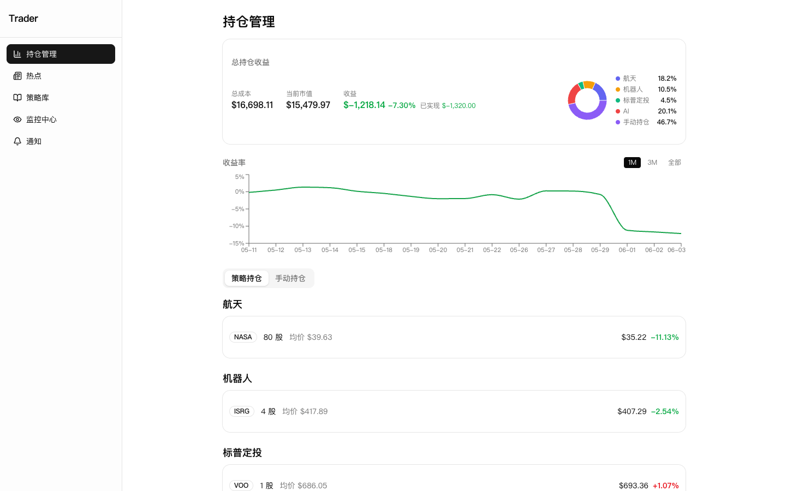
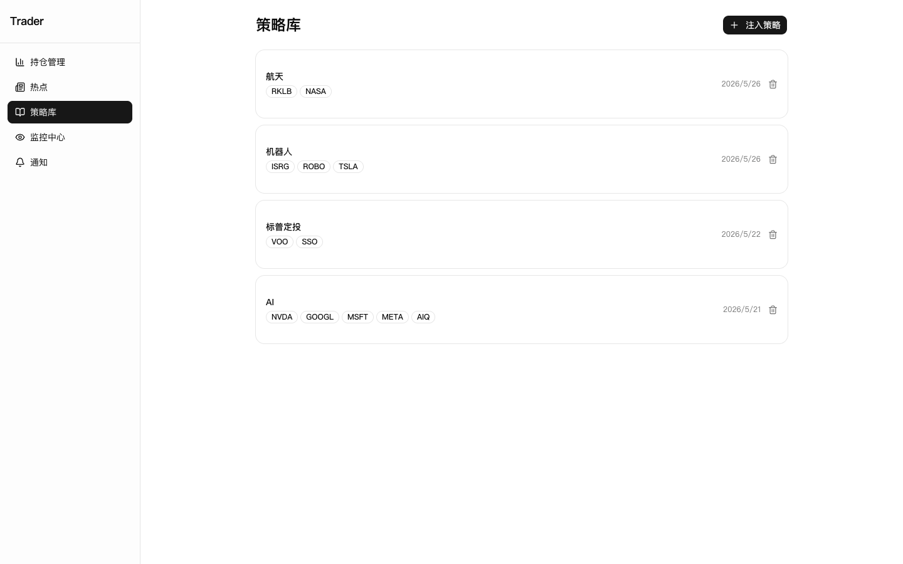
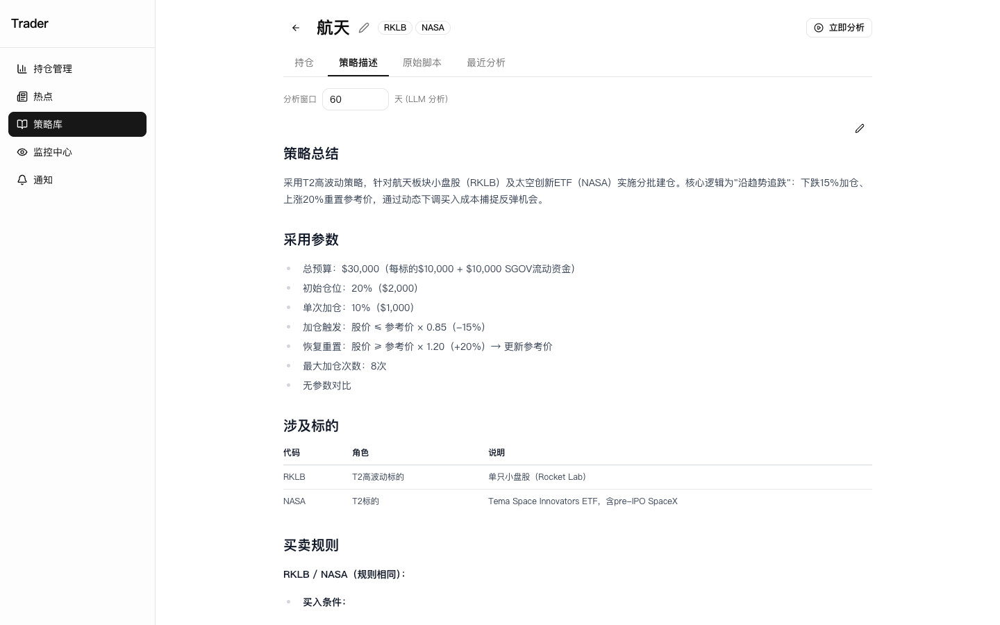
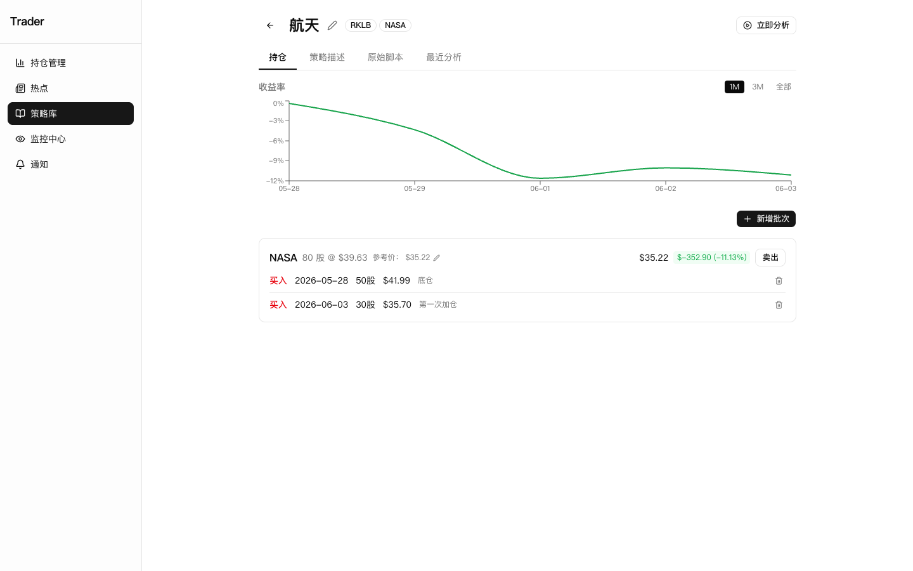
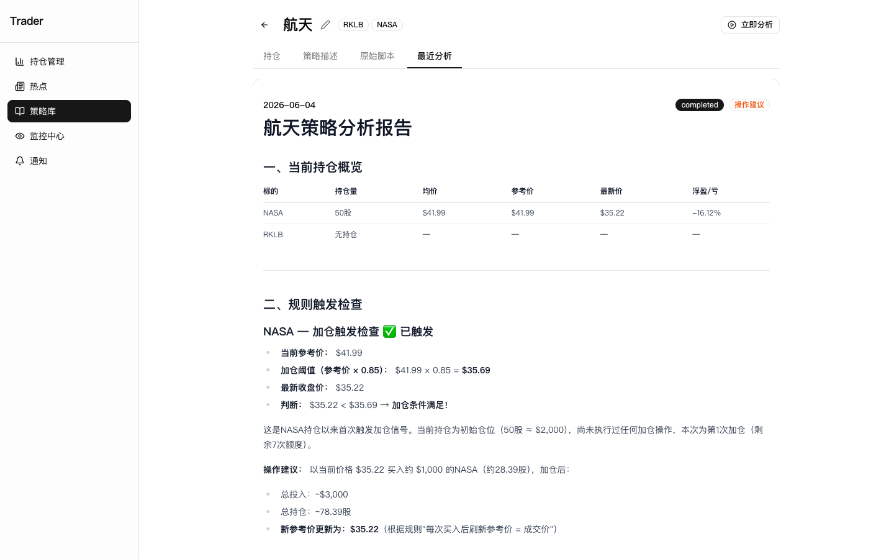
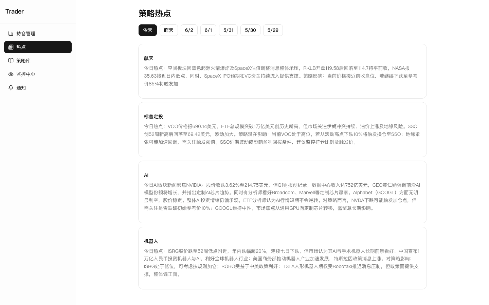
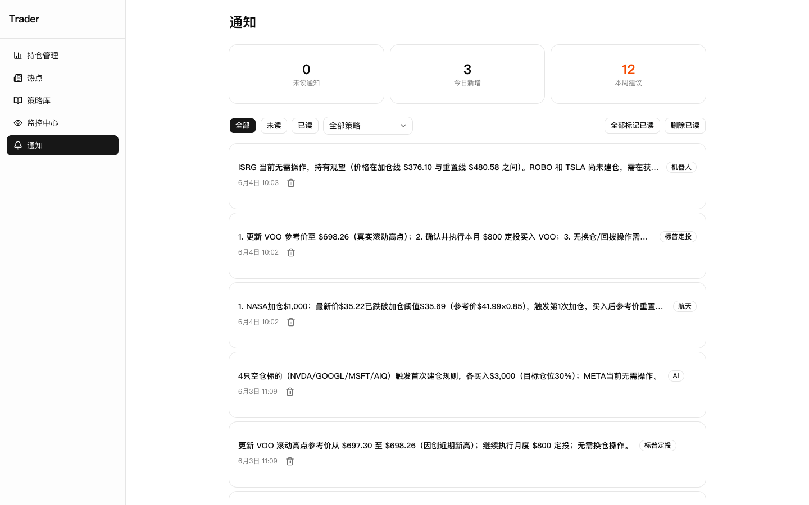

# Trader

> 单人股票投资的「持仓 + 策略 + AI 监控」一体化看板。
> 跑在 2GB 内存的小服务器上就够。

把你手写的 Python 策略脚本扔进去，让 LLM 按你的规则每天给你看盘 — 触发买卖信号时把分析报告推给你，不触发时就静静记录持仓盈亏。

> ⚠️ **这是一个分析/记账工具，不下单。** 不连接任何券商、不自动执行交易、不做高频策略。所有买卖都需要你在自己的券商手动完成，然后回到系统里登记 lot。



---

## 截图

<table>
  <tr>
    <td width="50%">
      <b>策略库</b><br>
      上传 Python 脚本，LLM 自动提取标的与买卖规则<br>
      
    </td>
    <td width="50%">
      <b>策略描述（LLM 解析）</b><br>
      把脚本翻译成结构化的中文策略卡<br>
      
    </td>
  </tr>
  <tr>
    <td>
      <b>策略详情 + 持仓时间线</b><br>
      P&L 曲线、参考价、买卖 lot 记录<br>
      
    </td>
    <td>
      <b>每日 AI 分析报告</b><br>
      规则触发检查、操作建议、参考价更新依据<br>
      
    </td>
  </tr>
  <tr>
    <td>
      <b>每日热点摘要</b><br>
      按策略关键词抓新闻 + LLM 提炼对持仓的影响<br>
      
    </td>
    <td>
      <b>通知中心</b><br>
      只有触发操作信号时才推送，避免噪音<br>
      
    </td>
  </tr>
</table>

---

## 特色

| | |
|---|---|
| 🪶 **极简部署** | 一个 `docker-compose up -d` 把 web + worker + postgres 全拉起来。资源墙：web 512MB、worker 384MB、postgres 512MB，**2GB 服务器跑得稳** |
| 🔧 **一份 .env 配齐** | 没有 OAuth、没有 Redis、没有第三方账号体系。改 `.env`、`force-recreate` 就完事 |
| 🧠 **任意 LLM 后端** | 用 Anthropic 协议接入 — 官方 Anthropic、百度千帆（GLM / 文心）、DeepSeek 兼容端点都能跑。**还可按场景独立配模型**：监控用聪明大模型、新闻摘要用便宜小模型 |
| 📈 **持仓正经做账** | 加权平均成本法、BUY/SELL 双向 lot、已实现/未实现分离、成本基础不会因卖出而错乱 |
| 🔄 **参考价自管理** | 策略写「涨超 15% 重置加仓基准」？LLM 每天读策略 + 行情自动改参考价，省去手动维护 |
| 📰 **每日新闻摘要** | 按策略关键词拉 Tavily，再让 LLM 提炼「今天的事和我持仓有啥关系」|
| 📊 **盈亏曲线** | 全账户 + 单策略历史 P&L 曲线，含已实现盈亏 |

---

## 能做 / 不能做

### ✅ 能做

- 上传 Python 策略脚本 → LLM 解析为结构化策略卡（标的、买卖规则、切换逻辑）
- 多策略并存，每个策略各自维护持仓 + 参考价 + 监控分析
- 手动持仓（不绑定策略）：自由记账场景
- 买卖 lot 时间线，已实现盈亏沉淀，已清仓不影响历史
- 每天 UTC 02:00 拉行情 + LLM 监控分析，触发信号时记录通知
- 每天 UTC 01:30 按策略关键词拉新闻 + LLM 摘要
- LLM 调用失败/限流时不污染数据库，下次重跑能自愈

### ❌ 不能做

- **下单** — 不接券商。买卖永远是你自己在券商执行后回来登记
- **盘中实时** — 行情按日 snapshot，不是 streaming
- **多用户** — 没有登录态，单人单部署
- **回测** — 持仓是只进不退的账本，不能模拟历史买卖
- **A 股以外的本地化数据源** — 行情走 Alpha Vantage / Finnhub，主要面向美股；A 股建议自己接数据源后改 worker

---

## 资源需求

| 项 | 最低 | 建议 |
|---|---|---|
| 内存 | 1.5 GB | 2 GB（默认配置就是按 2GB 调的） |
| 磁盘 | 5 GB | 20 GB（包含 postgres 数据 + docker 镜像） |
| CPU | 1 核 | 2 核（构建 web 镜像时会吃一会儿 CPU） |
| 网络 | — | 能访问 Anthropic 兼容 LLM 网关、Alpha Vantage、Tavily |

实测在阿里云 2 核 2GB ECS 上稳定运行。

---

## 技术栈

- **Web** — Next.js 16 (App Router) · React 19 · TypeScript · TailwindCSS · shadcn/ui
- **Worker** — Node.js + pg-boss（基于 Postgres 的任务队列，不需要额外的 Redis）
- **DB** — PostgreSQL 16 · Drizzle ORM
- **LLM** — `@anthropic-ai/sdk`（兼容任何 Anthropic 协议端点）
- **行情** — Alpha Vantage / Finnhub / yahoo-finance2
- **新闻** — Tavily API
- **部署** — Docker Compose

---

## 快速开始（本地）

```bash
# 1. 准备
git clone <repo-url> trader && cd trader
cp .env.example .env
# 编辑 .env：至少填 ANTHROPIC_API_KEY、ANTHROPIC_BASE_URL、ALPHAVANTAGE_API_KEY、TAVILY_API_KEY、POSTGRES_PASSWORD

# 2. 装依赖
npm install

# 3. 启 Postgres（用 docker 起一个就行，或本地装）
docker compose up -d postgres

# 4. 推 schema
cd packages/db && npx drizzle-kit push && cd -

# 5. 起 web + worker
npm run dev
```

打开 `http://localhost:3000`。

---

## 部署 SOP（生产 / 单机 Docker）

> 默认按"服务器上 build"走，最简单。如果服务器构建 web 时 OOM（典型：1GB 内存机器），切到「备用模式」，把 web 在本地 build 完上传 — 详见 [`docs/deploy.md`](docs/deploy.md)。

### 第一次部署

```bash
# 在服务器上
git clone <repo-url> /opt/trader
cd /opt/trader
cp .env.example .env
vi .env   # 填齐密钥（见下方"环境变量"）

# 跑 schema 迁移（首次必跑）
docker compose --profile tools run --rm db-migrate

# 拉起 stack
docker compose up -d

# 看健康状况
docker compose ps
docker compose logs -f worker
```

启动后访问 `http://<server-ip>`（默认监听 80 端口）。

### 日常发版

```bash
cd /opt/trader
git pull --ff-only

# 大多数情况只动 worker 或 web 一个
docker compose build worker && docker compose up -d --force-recreate worker
# 或
docker compose build web && docker compose up -d --force-recreate web

# schema 改了的话先迁
docker compose --profile tools run --rm db-migrate
```

> 💡 **永远把 service 名加在末尾**（`worker` / `web`），否则 `docker compose up -d` 不带参数会 recreate 全部服务，包括 web — 1-2GB 小机器上 web 重建容易 OOM。

### 改完 .env 重启

```bash
# .env 改动后，必须 force-recreate（restart 不会重读 .env）
docker compose up -d --force-recreate worker web

# 验证容器拿到了最新值
docker compose exec worker env | grep ANTHROPIC
```

### 手动触发后台任务

```bash
docker compose run --rm -w /app db-migrate \
  npx tsx scripts/trigger-job.ts <queue>
# queue: daily-monitoring | daily-price-refresh | daily-news
```

---

## 环境变量

只有 4 个必填。

| 变量 | 必填 | 说明 |
|---|---|---|
| `POSTGRES_PASSWORD` | ✅ | 数据库密码（自定，启动时 postgres 会用它） |
| `DATABASE_URL` | ✅ | 形如 `postgresql://postgres:<密码>@postgres:5432/trader` |
| `ANTHROPIC_API_KEY` | ✅ | LLM API Key（官方 Anthropic / 千帆 / DeepSeek 等） |
| `ANTHROPIC_BASE_URL` | ⬜ | 第三方 Anthropic 兼容网关地址，默认走官方 |
| `ANTHROPIC_MODEL` | ⬜ | 默认模型，例如 `glm-5.1` / `claude-sonnet-4-6` |
| `ALPHAVANTAGE_API_KEY` | ✅ | 行情接口（[免费申请](https://www.alphavantage.co/support/#api-key)） |
| `TAVILY_API_KEY` | ✅ | 新闻搜索（[免费申请](https://tavily.com/)） |
| `FINNHUB_API_KEY` | ⬜ | 备用行情源 |

### 按场景拆分 LLM 配置（可选）

三种场景都可独立指定 `KEY` / `BASE_URL` / `MODEL`，未设置时 fallback 到默认 `ANTHROPIC_*`：

| 场景 | 后缀 |
|---|---|
| 每日新闻摘要 | `_NEWS` |
| 每日策略监控 | `_MONITORING` |
| 策略脚本解析 | `_PARSE` |

例：新闻摘要走便宜的 DeepSeek，监控走 GLM 默认：

```bash
ANTHROPIC_API_KEY=<your-glm-key>
ANTHROPIC_BASE_URL=https://qianfan.baidubce.com/anthropic/coding
ANTHROPIC_MODEL=glm-5.1

ANTHROPIC_API_KEY_NEWS=<your-deepseek-key>
ANTHROPIC_BASE_URL_NEWS=https://api.deepseek.com/anthropic
ANTHROPIC_MODEL_NEWS=deepseek-chat
```

---

## 项目结构

```
apps/
  web/        # Next.js 前端 + API Routes
    app/      # App Router 页面与 API 路由
    lib/      # 业务逻辑（持仓、盈亏、策略解析）
    components/
  worker/     # 后台 Job（cron 拉行情 + LLM 分析 + 新闻摘要）
    src/
      monitoring/  # 每日监控
      news/        # 每日新闻
      lib/         # 共享配置
packages/
  db/         # Drizzle schema 与共享 DB 工具
scripts/      # 一次性脚本（迁移、回填、触发任务）
docs/
  deploy.md   # 部署详解（含小机器备用模式）
openspec/     # 项目变更规范（每个能力一个 spec）
```

---

## 开发命令

```bash
npm run dev          # 同时跑 web + worker dev server
npm test             # 全 workspace 测试
npm run build        # 全 workspace build

# 单独跑某个 workspace 的测试
cd apps/worker && npx vitest run
cd apps/web    && npx vitest run

# 类型检查（不产出文件）
cd apps/worker && npx tsc --noEmit
```

---

## 路线图

- [ ] A 股行情接入（同花顺 / 雪球数据源）
- [ ] 策略回测（基于历史 price_snapshots）
- [ ] 多用户 + 简单认证（OAuth / Magic Link）
- [ ] 移动端通知 push（目前只在站内消息中心）
- [ ] 持仓 CSV 导入/导出

PR / Issue 欢迎。

---

## 许可证

[MIT](LICENSE)

---

## 致谢

- [pg-boss](https://github.com/timgit/pg-boss) — 让 worker 不需要 Redis
- [Drizzle ORM](https://orm.drizzle.team/) — 类型安全的 SQL
- [shadcn/ui](https://ui.shadcn.com/) — 组件生态
- [Tavily](https://tavily.com/) — 新闻搜索 API
